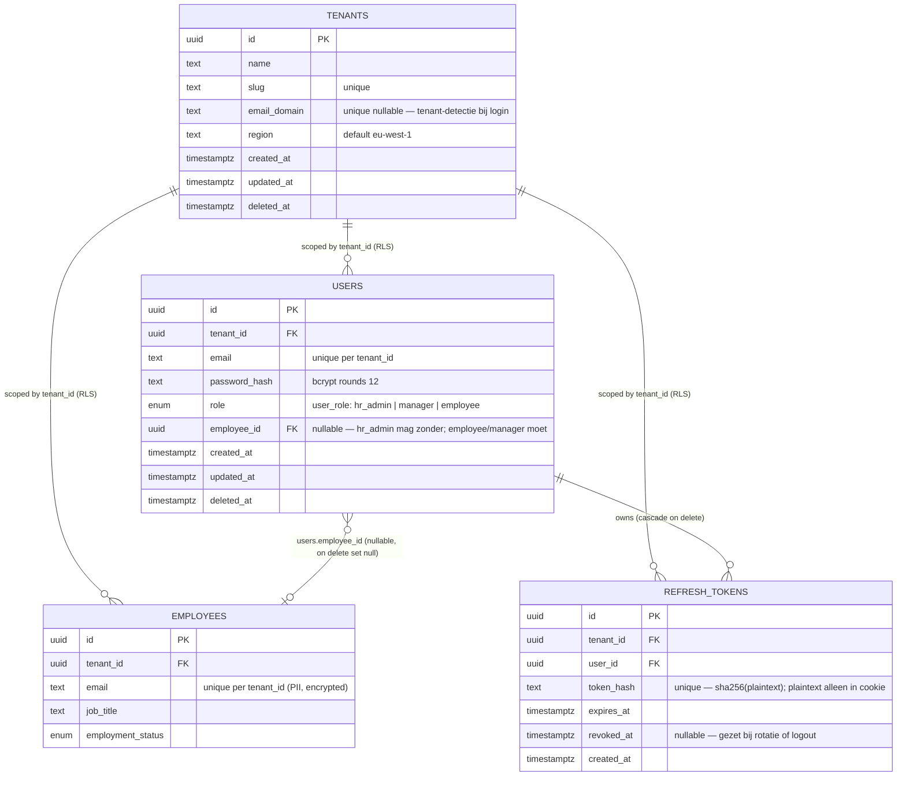

# Datamodel — Auth (FEAT-0002)

> Bron: [`packages/db/prisma/schema.prisma`](../../packages/db/prisma/schema.prisma)
> Migratie: `packages/db/prisma/migrations/20260422120000_add_users_and_refresh_tokens/migration.sql`
> Beslissing: [ADR-0006](../adr/0006-auth-cookie-strategie.md)

## ER-diagram



## Beslissingen — kort

- **`tenants.email_domain`** is uniek + nullable. Login flow doet email-split → domain-lookup → `tenant_id`. Bestaande tenants moeten dit veld krijgen vóór login werkt; geen automatische backfill (operationeel via runbook).
- **`users.email`** is plaintext (afwijkend van `employees.email`). Reden: login vereist plaintext lookup. RLS + bcrypt zijn de overgebleven beveiligingslagen. Zie ADR-0006 § 5.
- **`users.password_hash`** is bcrypt rounds 12 (~100ms login-cost). Nooit in API-responses, nooit in logs.
- **`users.employee_id`** is nullable FK met `ON DELETE SET NULL`. Service-laag dwingt af dat `role IN ('manager', 'employee')` een gevulde `employee_id` heeft; voor `hr_admin` mag dit leeg zijn.
- **`refresh_tokens.token_hash`** slaat alleen sha256-hash op. Plaintext leeft uitsluitend in de browser-cookie + tijdelijk in API-memory tijdens uitgifte/lookup. Een datalek geeft geen werkende tokens.
- **`refresh_tokens` rotatie**: bij elke succesvolle `/auth/refresh` wordt het oude token revoked (`revoked_at = now()`) en een nieuw token uitgegeven. Hergebruik van een revoked token = 401 + alert (toekomstige integriteit-check).
- **RLS aan op `users` en `refresh_tokens`** met dezelfde `tenant_isolation_*` policies als `employees`. Alle queries moeten via `withTenant()` lopen.
- **Audit-trigger op `users`** logt elke INSERT/UPDATE/DELETE in `audit_events` in dezelfde transactie. Geen trigger op `refresh_tokens` (high-volume + ephemeral).

## Authenticatie-flow (sequence)

```mermaid
sequenceDiagram
  autonumber
  participant Browser
  participant Web as Nuxt SSR
  participant API as Fastify
  participant DB as Postgres

  rect rgb(245, 245, 245)
    note over Browser,DB: Login
    Browser->>Web: POST /login {email, password}
    Web->>API: POST /v1/auth/login
    API->>DB: SELECT id FROM tenants WHERE email_domain = $domain
    DB-->>API: tenant_id
    API->>DB: SET LOCAL app.tenant_id = $tenant_id
    API->>DB: SELECT * FROM users WHERE tenant_id = $1 AND email = $2
    DB-->>API: user (RLS-scoped)
    API->>API: bcrypt.compare(password, user.password_hash)
    API->>DB: INSERT refresh_tokens (token_hash, expires_at = now() + 7d)
    API-->>Web: 200 {access_token, expires_in: 900} + Set-Cookie hr_refresh + hr_csrf
    Web-->>Browser: redirect / + cookies
  end

  rect rgb(245, 245, 245)
    note over Browser,DB: Authenticated request
    Browser->>Web: GET /employees
    Web->>API: GET /v1/employees met Authorization: Bearer <jwt>
    API->>API: verify JWT → {sub, tenantId, role}
    API->>DB: SET LOCAL app.tenant_id = $tenantId; SET LOCAL app.user_id = $sub
    API->>DB: SELECT * FROM employees (RLS-scoped automatisch)
    DB-->>API: employees voor deze tenant
    API-->>Web: 200 {items, nextCursor}
  end

  rect rgb(245, 245, 245)
    note over Browser,DB: Refresh (15 min later)
    Browser->>Web: GET /employees (na expired access-token)
    Web->>API: GET met expired JWT
    API-->>Web: 401 {error: "token_expired"}
    Web->>API: POST /v1/auth/refresh + cookie hr_refresh + header X-CSRF-Token
    API->>API: cookies.hr_csrf == headers.x-csrf-token?
    API->>DB: SELECT * FROM refresh_tokens WHERE token_hash = $sha256 AND revoked_at IS NULL AND expires_at > now()
    DB-->>API: refresh_token rij
    API->>DB: UPDATE refresh_tokens SET revoked_at = now() WHERE id = $1
    API->>DB: INSERT refresh_tokens (nieuw token)
    API-->>Web: 200 {access_token} + Set-Cookie hr_refresh (rotated) + hr_csrf (rotated)
    Web->>API: retry GET /employees met nieuw JWT
  end
```

## Open follow-ups

- **FEAT-0012 (GDPR hard-delete)**: cascade-policy voor `users` wanneer een persoon wordt vergeten. Soft-delete (deleted_at) is al aanwezig; hard-delete moet `refresh_tokens` opruimen (cascade staat al goed) en `audit_events`-rijen pseudonimiseren (apart beleid).
- **Refresh-token cleanup-job**: Sprint 2 doet "lazy cleanup at refresh-call". Bij groei: cron-job die `DELETE FROM refresh_tokens WHERE expires_at < now() - interval '30 days'`.
- **Subdomain-tenant-routing** (Sprint 3+): vervangt of ondersteunt `email_domain`-lookup voor white-label scenarios.
- **Hergebruik-detectie revoked refresh-token**: huidige flow geeft 401, maar zou óók de hele user-sessie moeten invalideren (alle refresh_tokens van die user revoken). Eenvoudig toe te voegen, maar buiten Sprint 2 om implementatie-risico te beperken.
